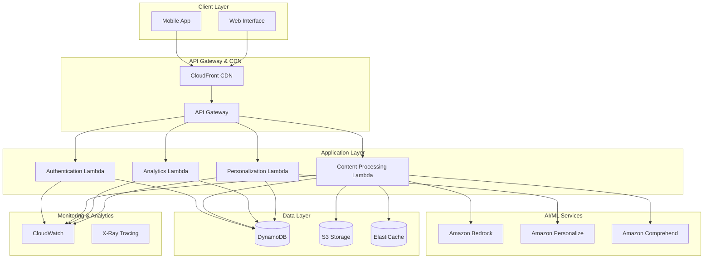

# Design Document: AI Learning Support System

## Overview

The AI Learning Support System is a cloud-native, mobile-first platform designed to provide personalized learning assistance to Tier-2 and Tier-3 Indian engineering students. The system leverages AWS managed services to deliver scalable, cost-effective learning support that addresses cognitive overload, learning consistency, and knowledge gap identification.

The architecture follows a serverless-first approach using AWS Lambda, API Gateway, and managed databases to minimize operational overhead while maintaining high availability and automatic scaling. The system integrates AI/ML capabilities through AWS services like Amazon Bedrock for content generation and Amazon Personalize for learning path recommendations.

## Architecture

### High-Level Architecture



### Deployment Architecture

The system uses a multi-region deployment strategy with primary deployment in AWS Asia Pacific (Mumbai) region for optimal latency to Indian users, with CloudFront global distribution for static content delivery.

## Components and Interfaces

### 1. Mobile Interface Component

**Purpose**: Provides the primary user interface optimized for smartphone usage with offline capabilities.

**Key Features**:
- Progressive Web App (PWA) architecture for cross-platform compatibility
- Offline-first design with local storage for essential content
- Responsive design supporting 4.5" to 6.5" screen sizes
- Data-efficient loading with content prioritization

**Interfaces**:
- REST API integration with API Gateway
- Local storage for offline content caching
- Push notification integration via AWS SNS

### 2. Content Processing Service

**Purpose**: Handles topic decomposition, content adaptation, and learning material generation.

**Implementation**: AWS Lambda functions with Amazon Bedrock integration

**Key Responsibilities**:
- Complex topic breakdown into digestible sub-concepts
- Content difficulty adaptation based on student proficiency
- Generation of contextually relevant examples for Indian engineering students
- Multi-language content translation and localization

**Interfaces**:
```typescript
interface ContentProcessor {
  decomposeTopics(topic: string, studentLevel: ProficiencyLevel): TopicBreakdown
  adaptContent(content: Content, studentProfile: StudentProfile): AdaptedContent
  generateExamples(concept: string, context: string): Example[]
  translateContent(content: Content, targetLanguage: Language): Content
}
```

### 3. Learning Path Engine

**Purpose**: Creates personalized learning sequences and manages student progress through adaptive pathways.

**Implementation**: AWS Lambda with Amazon Personalize for recommendation algorithms

**Key Responsibilities**:
- Personalized learning path generation based on student gaps and goals
- Dynamic path adjustment based on performance and engagement
- Learning session scheduling and reminder management
- Progress tracking and milestone recognition

**Interfaces**:
```typescript
interface LearningPathEngine {
  generateLearningPath(studentProfile: StudentProfile, goals: LearningGoal[]): LearningPath
  updatePathProgress(studentId: string, completedActivity: Activity): PathUpdate
  scheduleNextSession(studentId: string, preferences: SchedulePreferences): ScheduledSession
  identifyLearningGaps(assessmentResults: AssessmentResult[]): LearningGap[]
}
```

### 4. Student Analytics Service

**Purpose**: Tracks learning patterns, analyzes performance, and provides insights for personalization.

**Implementation**: AWS Lambda with DynamoDB Streams for real-time analytics

**Key Responsibilities**:
- Real-time learning activity tracking
- Performance pattern analysis and trend identification
- Learning gap detection and prioritization
- Engagement metrics and retention analysis

**Interfaces**:
```typescript
interface AnalyticsService {
  trackLearningActivity(studentId: string, activity: LearningActivity): void
  analyzePerformancePatterns(studentId: string, timeframe: TimeRange): PerformanceAnalysis
  generateProgressReport(studentId: string): ProgressReport
  identifyOptimalStudyTimes(studentId: string): StudyTimeRecommendations
}
```

### 5. Authentication and User Management

**Purpose**: Manages student authentication, profiles, and access control.

**Implementation**: AWS Cognito for authentication with Lambda for profile management

**Key Responsibilities**:
- Secure student authentication and session management
- Student profile creation and maintenance
- Learning preferences and settings management
- Multi-device session synchronization

## Data Models

### Student Profile Model

```typescript
interface StudentProfile {
  studentId: string
  personalInfo: {
    name: string
    email: string
    phoneNumber?: string
    preferredLanguage: Language
    institution?: string
    academicYear: number
  }
  learningProfile: {
    proficiencyLevels: Map<Subject, ProficiencyLevel>
    learningStyle: LearningStyle
    preferredSessionDuration: number
    optimalStudyTimes: TimeSlot[]
    currentStreak: number
    totalLearningHours: number
  }
  preferences: {
    notificationSettings: NotificationPreferences
    contentComplexity: ComplexityLevel
    exampleTypes: ExampleType[]
  }
  createdAt: Date
  lastActiveAt: Date
}
```

### Learning Activity Model

```typescript
interface LearningActivity {
  activityId: string
  studentId: string
  topicId: string
  activityType: ActivityType
  content: {
    title: string
    description: string
    materials: LearningMaterial[]
    estimatedDuration: number
  }
  completion: {
    status: CompletionStatus
    startedAt?: Date
    completedAt?: Date
    timeSpent: number
    performanceScore?: number
  }
  feedback: {
    difficulty: DifficultyRating
    clarity: ClarityRating
    helpfulness: HelpfulnessRating
    comments?: string
  }
}
```

### Learning Gap Model

```typescript
interface LearningGap {
  gapId: string
  studentId: string
  subject: Subject
  topic: string
  subConcepts: string[]
  severity: GapSeverity
  identifiedAt: Date
  evidence: {
    assessmentResults: AssessmentResult[]
    strugglingActivities: string[]
    timeToComplete: number
    errorPatterns: ErrorPattern[]
  }
  remediation: {
    recommendedActivities: string[]
    estimatedTimeToClose: number
    priority: Priority
  }
  status: GapStatus
}
```

### Content Model

```typescript
interface Content {
  contentId: string
  title: string
  subject: Subject
  topics: string[]
  complexity: ComplexityLevel
  language: Language
  content: {
    text: string
    examples: Example[]
    visualAids?: VisualAid[]
    practiceProblems?: Problem[]
  }
  metadata: {
    createdAt: Date
    lastUpdated: Date
    version: string
    tags: string[]
    estimatedReadingTime: number
  }
  adaptations: {
    simplified?: Content
    detailed?: Content
    translations?: Map<Language, Content>
  }
}
```

Now I need to use the prework tool to analyze the acceptance criteria before writing the Correctness Properties section.

## Correctness Properties

*A property is a characteristic or behavior that should hold true across all valid executions of a system—essentially, a formal statement about what the system should do. Properties serve as the bridge between human-readable specifications and machine-verifiable correctness guarantees.*

### Property 1: Topic Decomposition Consistency
*For any* complex technical topic, the Learning_System should decompose it into 3-5 sub-concepts ordered from basic to advanced, with recursive decomposition available for any sub-concept that remains too complex.
**Validates: Requirements 1.1, 1.2, 1.3**

### Property 2: Content Adaptation Accuracy
*For any* learning content and student proficiency level, the Content_Adapter should produce adapted content that matches the student's demonstrated proficiency level and includes contextually relevant Indian engineering examples.
**Validates: Requirements 1.4, 1.5**

### Property 3: Learning Schedule Generation
*For any* set of learning goals and student preferences, the Learning_System should generate a personalized daily study schedule that accommodates the student's availability and learning capacity.
**Validates: Requirements 2.1**

### Property 4: Learning Consistency Management
*For any* student learning activity pattern, the system should correctly track streaks, provide timely reminders for missed activities, acknowledge achievements at appropriate milestones, and offer recovery support for broken streaks.
**Validates: Requirements 2.2, 2.3, 2.4, 2.5**

### Property 5: Cognitive Load Boundaries
*For any* learning session, the system should limit active content to 15-25 minutes, introduce maximum 3 new terms, provide visual progress indicators, and offer appropriate breaks between sessions.
**Validates: Requirements 3.1, 3.2, 3.4, 3.5**

### Property 6: Adaptive Intervention
*For any* student showing confusion patterns or repeated errors, the Learning_System should pause current activities and offer relevant review materials.
**Validates: Requirements 3.3**

### Property 7: Learning Gap Management
*For any* student assessment results, the system should accurately identify knowledge gaps, prioritize them by impact, generate appropriate learning paths, track closure progress, and update proficiency profiles when gaps are resolved.
**Validates: Requirements 4.1, 4.2, 4.3, 4.4, 4.5**

### Property 8: Offline Functionality
*For any* downloaded learning content, the system should provide basic learning features without network connectivity.
**Validates: Requirements 5.2**

### Property 9: Adaptive Content Delivery
*For any* network connectivity condition, the system should prioritize appropriate content types (text-first for poor connectivity) and maintain functionality across screen sizes from 4.5 to 6.5 inches.
**Validates: Requirements 5.3, 5.4**

### Property 10: Multi-Language Support
*For any* supported language (English, Hindi), the system should provide complete feature functionality, maintain consistent terminology translations, persist language preferences across sessions, and allow in-session language switching where available.
**Validates: Requirements 7.1, 7.2, 7.3, 7.4, 7.5**

### Property 11: Progress Tracking Accuracy
*For any* student learning activities, the Progress_Tracker should generate accurate weekly summaries, display competency improvements with baseline comparisons, provide detailed breakdowns by subject and skill, identify learning patterns for study time optimization, and maintain historical data for at least 6 months.
**Validates: Requirements 8.1, 8.2, 8.3, 8.4, 8.5**

### Property 12: Personalization Effectiveness
*For any* new student, the system should conduct baseline assessments, adapt content to learning style preferences, provide alternative explanations for struggling areas, remember successful teaching strategies, and gradually increase difficulty as competency improves.
**Validates: Requirements 9.1, 9.2, 9.3, 9.4, 9.5**

## Error Handling

### Input Validation and Sanitization
- All user inputs must be validated against expected formats and ranges
- Content uploads must be scanned for malicious content
- API requests must include rate limiting and authentication validation
- Student assessment responses must be validated for completeness and format

### Graceful Degradation Strategies
- **Network Connectivity Issues**: Fall back to cached content and offline functionality
- **AI Service Unavailability**: Use pre-generated content and fallback recommendation algorithms
- **Database Connection Failures**: Implement circuit breaker patterns with local caching
- **High Load Conditions**: Implement request queuing and priority-based processing

### Data Consistency and Recovery
- **Learning Progress Data**: Implement eventual consistency with conflict resolution for multi-device usage
- **Assessment Results**: Ensure atomic updates to prevent partial score recording
- **Content Synchronization**: Handle offline-to-online sync with conflict detection and resolution
- **User Profile Updates**: Implement optimistic locking to prevent concurrent modification issues

### Error Monitoring and Alerting
- Real-time error tracking using AWS CloudWatch and X-Ray
- Automated alerts for critical system failures and performance degradation
- User-facing error messages that provide helpful guidance without exposing system internals
- Comprehensive logging for debugging and audit trails

## Testing Strategy

### Dual Testing Approach

The system requires both unit testing and property-based testing to ensure comprehensive coverage:

**Unit Tests**: Focus on specific examples, edge cases, and error conditions including:
- Authentication flow validation with various credential combinations
- Content adaptation for specific proficiency levels and learning styles
- Database operations with edge cases (empty results, connection failures)
- API endpoint responses for various input scenarios
- Integration points between AWS services

**Property-Based Tests**: Verify universal properties across all inputs including:
- Topic decomposition consistency across diverse technical subjects
- Learning path generation for various student profiles and goals
- Content adaptation accuracy for different proficiency levels
- Progress tracking precision across different learning patterns
- Multi-language functionality across supported languages

### Property-Based Testing Configuration

**Testing Framework**: Use Hypothesis (Python) or fast-check (TypeScript/JavaScript) for property-based testing
**Test Configuration**: Minimum 100 iterations per property test to ensure comprehensive input coverage
**Test Tagging**: Each property test must reference its design document property using the format:
- **Feature: ai-learning-support, Property 1: Topic Decomposition Consistency**
- **Feature: ai-learning-support, Property 7: Learning Gap Management**

### Integration Testing Strategy

**AWS Service Integration**: Test integration points with Amazon Bedrock, Personalize, and Cognito using AWS SDK mocks and localstack for local development
**Database Testing**: Use DynamoDB Local for unit tests and test databases for integration tests
**API Testing**: Comprehensive API endpoint testing including authentication, rate limiting, and error scenarios
**Mobile Interface Testing**: Cross-device testing on various screen sizes and network conditions

### Performance and Load Testing

**Scalability Validation**: Test system behavior under various load conditions up to 10,000 concurrent users
**Response Time Verification**: Ensure API responses meet the 2-second requirement under normal and peak loads
**Resource Optimization**: Validate auto-scaling behavior and cost optimization during low-usage periods
**Mobile Performance**: Test content loading times and data consumption on various network conditions

### Monitoring and Observability

**Real-time Metrics**: CloudWatch dashboards for system health, user engagement, and learning outcomes
**Distributed Tracing**: X-Ray integration for request flow analysis and performance bottleneck identification
**User Experience Monitoring**: Track learning session completion rates, user satisfaction scores, and feature adoption
**Business Metrics**: Monitor learning gap closure rates, student retention, and system effectiveness indicators